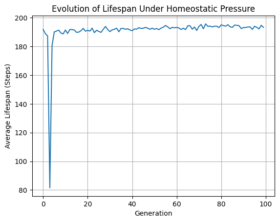

# Project Archean: Emergent Chemotaxis via Homeostatic Constraints

## Abstract
This repository implements a bottom-up, artificial life (ALife) framework testing an inversion of the current AI paradigm. While modern deep learning models focus on top-down cognitive tasks (text tokens, static optimization datasets), **Project Archean** models intelligence as an emergent byproduct of autopoiesis and thermodynamic self-maintenance. 

Agents (Artificial Cells) are embedded in a continuous grid environment containing a localized energy gradient. They receive no explicit task-reward labels. Instead, they operate under strict metabolic costs where survival and replication are the sole evolutionary drivers.

## Theoretical Foundations
1. **The Free Energy Principle & Autopoiesis:** Agents maintain structural integrity against entropy by developing latent predictive models of resource locations.
2. **Lineage Memory ("The Soul"):** Successful configurations of neural architectures are permanently saved and passed down across generational cell divisions via genetic inheritance, establishing a continuous historical trajectory without catastrophic forgetting.

## Simulation Mechanics
* **Metabolic Cost:** Every spatial movement costs `0.5` energy units.
* **Homeostasis:** If internal energy drops to `0`, the agent is permanently pruned from the simulation (death).
* **Mitosis:** If an agent reaches `200` units of energy, it undergoes cellular division, passing mutated neural weights down to its lineage.
* **Carrying Capacity:** The environment supports a maximum of 500 agents, forcing strict evolutionary competition for spatial resources.

## Experimental Progression & Tuning

* **v1.0 - The Great Filter:** Initialized with harsh metabolic costs. Result: **Extinction at Gen 0.** The baseline entropy outpaced random exploration. 
* **v1.1 - The Cambrian Explosion:** Relaxed metabolic decay and expanded vent radius. Result: **Runaway Population.** The population exploded to 200,000+ agents by Gen 1. The replication mechanism succeeded, but the lack of resource limits removed evolutionary pressure.
* **v1.2 - The Evolutionary Bottleneck:** Implemented a strict carrying capacity (500 agents). Result: **Stabilized Evolution.** The environment now prunes the weakest agents dynamically. Cells must evolve the most efficient neural pathways to navigate gradients faster than their peers.

## Results: Generational Adaptation
Over 100 generations, the simulation demonstrates a clear, rapid adaptation from random wandering to highly efficient, gradient-directed chemotaxis. 

*Simulation built in Python/NumPy.*
